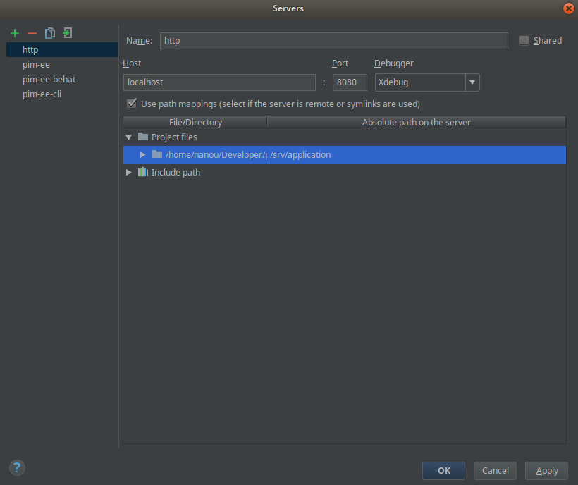
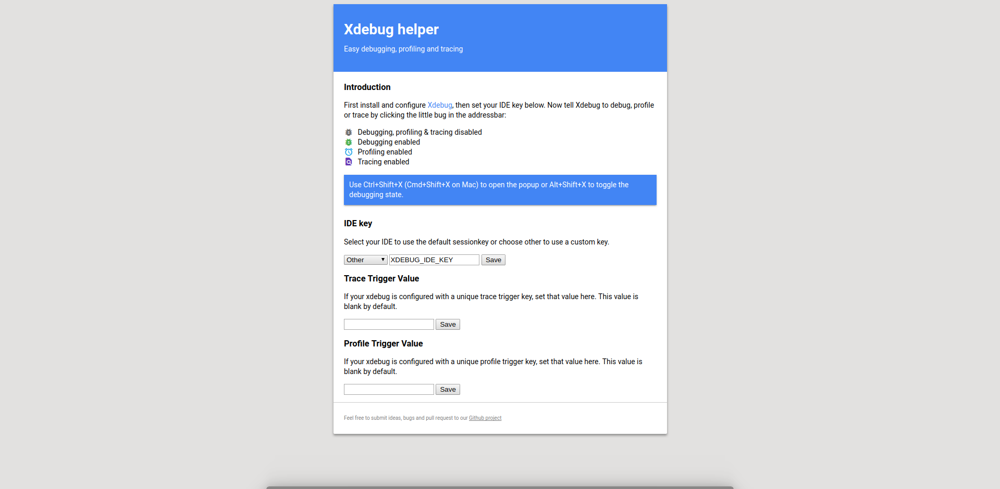

# Debugging

The content of this guide will help you to configure your PHPStorm in order to debug the PIM.
The following doc is about Linux only and is not tested on other OS.

## Container config

*Xdebug* is deactivated by default. If you want to activate it, you need to set the following environment variables,
 in this case we use a part of the default configuration of the Akeneo PIM 2.0 which use fpm and httpd but this is the same spirit for others versions:
```yaml
services:
  fpm:
    image: akeneo/fpm:php-7.1
    environment:
      PHP_IDE_CONFIG: 'serverName=pim-ce-cli' # Your will need the server name for your IDE config
      PHP_XDEBUG_ENABLED: 1 # Set to 0 if you don't want to activate xdebug
      PHP_XDEBUG_IDE_KEY: 'XDEBUG_IDE_KEY' # the IDE KEY you want to use
      XDEBUG_CONFIG: 'remote_host=xxx.xxx.xxx.xxx' # Your host IP address, this one is needed only if the docker daemon run on TCP instead of unix domain socket (on Mac OS for instance)
    volumes:
      - ./:/srv/pim

  httpd:
      image: httpd:2.4
      depends_on:
        - fpm
      environment:
        PHP_IDE_CONFIG: 'serverName=pim-ce' # Your will need the server name for your IDE config
      ports:
        - '8080:80' # You will need the 8080 for your configuration
```

Then you just have to run `docker-compose up -d` again and XDebug will be activated.

## Tools Config

### PHPStorm

First of all, you have to setup your server, in PHPStorm go on the `Setting > Servers` section.
Then you have to add one, and configure like this.



You can see that:
- The name is the same than my `serverName` of my container configuration
- The host is `localhost`
- The port is the one which is accessible from your host (in the case of cli, the port to use use is `80`)
- The absolute path on server mapping is the one that you configure in your server, here `/srv/pim`

You will have to duplicate it for all your servers, in the case of a PIM installation, you will have to setup
- pim-ce
- pim-ce-behat
- pim-cli

Then, you have to setup the configuration of your debugger, you can find under the Menu `Run > Edit Configurations...`
Then, click on `+` and choose `PHP Remote Debug` and configure a remote debug like this


You can see that:
- You have to choose a name, we generally choose to name it the same way than you server (here `pim-ce`)
- You have to check `Filter debug connection by IDE key`
- You have to select the corresponding server (here `pim-ce`)
- You have to enter the `IDE key (session_id)`, here the default one `XDEBUG_IDE_KEY`

Then, you have to enable XDebug in your PHPSTORM as you would do for all PHP applications.

### Google Chrome

You will have to download a plugin such as [xdebug helper](https://chrome.google.com/webstore/detail/xdebug-helper/eadndfjplgieldjbigjakmdgkmoaaaoc)

And the configure it like this 



You can see that:
- You have to change the `IDE key` by `Other` and the key you have chosen (here `XDEBUG_IDE_KEY`)

